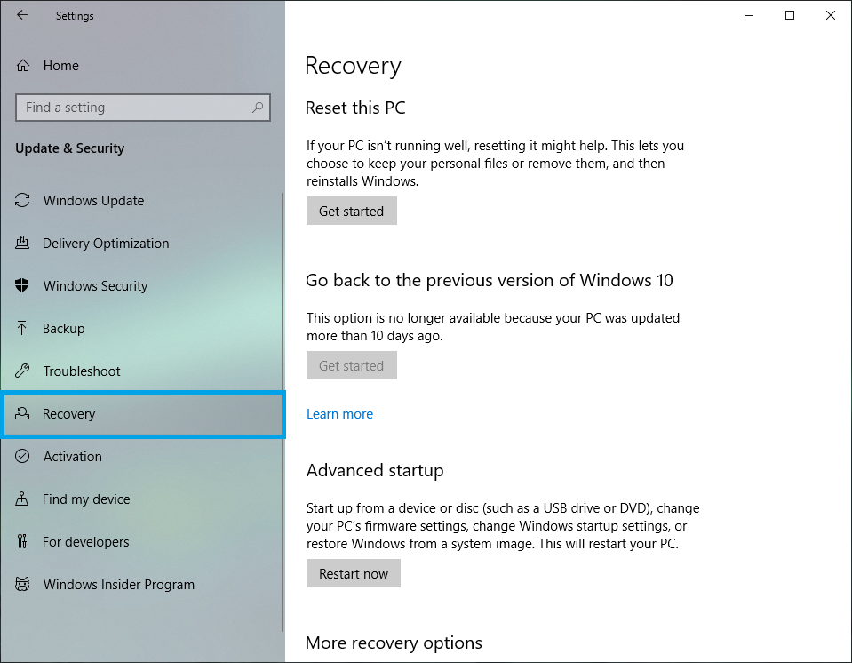
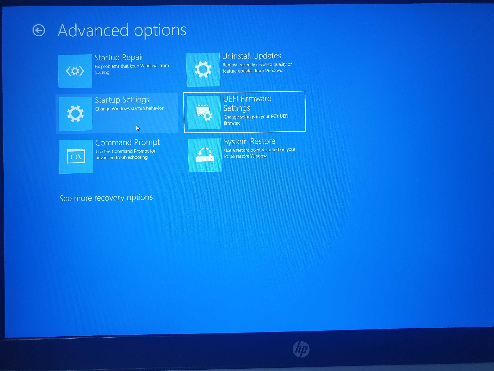
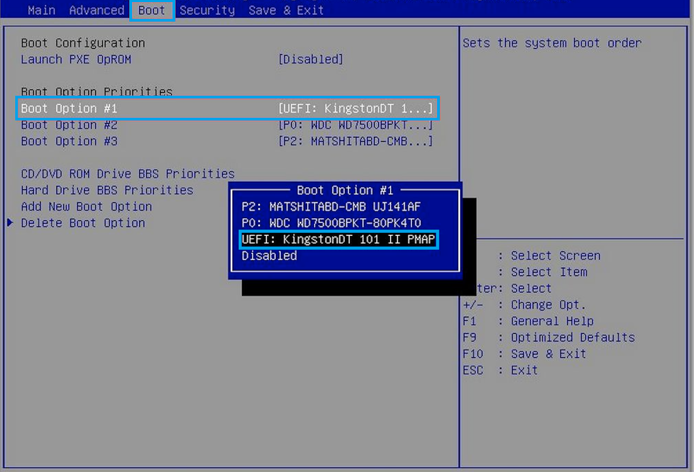

## 1. To enter BIOS/UEFI
- Check the connection of local disk or USB flash drive with Wayne OS installed when the PC is turned off
- Once the PC is turned on, press the BIOS/UEFI entrance key repeatedly, which varies depending on the PC model and manufacturer as per below example

| manufacturer     | Key    |
| ------ | ------ |
| HP     | 	F1 / F2 / F6 / F10 / F11 / F12 / ESC |
| Dell   | 	F1 / F2 / F3 / F12 / DEL / CTRL+ALT+ENTER / DEL+ESC / Fn+ESC / Fn+F1 |
| Lenovo | 	F1 / F2 / F12 / Fn+F2 / Enter-F1 / CTRL+ALT+F3 / CTRL+ALT+INC / Fn+F1|
| Acer   |  F1 / F2 / F10 / DEL / CTRL+ALT+ESC |
| Asus   | 	F2 / F10 / DEL / INSERT |
| Toshiba| 	F1 / F2 / F12 / ESC |
| Samsung|  F2 |
| Sony   |  F1 / F2 / F3 / ASSIST |
| MSI    | 	F2 / DEL |
| ASRock | 	F2 / DEL |
| ECS    |  DEL |
| Gigatbyte/Aorus| F2 / DEL |
| MS Surface Tablets| Press and hold volume up button |
| Origin |  F2 |
| Zorac  |  DEL|
#### Alternative way to enter BIOS/UEFI with Windows10
- Navigate to **Settings** in Windows 10 start menu

- Click **Update & Security** in Windows Settings

- Select **Recovery** in the left pane

- Click **Restart now** under the Advanced startup header (computer will reboot)

- Click **Troubleshoot** in Choose an option with blue screen

- Click **Advanced options**

- Click **UEFI Firmware Settings**

- Click **Restart** to confirm

## 2. Setup BIOS/UEFI
- Once entering the BIOS/UEFI menu, set your USB flash drive into boot order number 1

- Turn off Secure Boot and Fast Boot
- Save your setting and reboot

## 3. Start OS
- Wayne OS splash screen will be displayed
- Once booting, configure language, accessibility, network
- Login with Google account or guest mode
