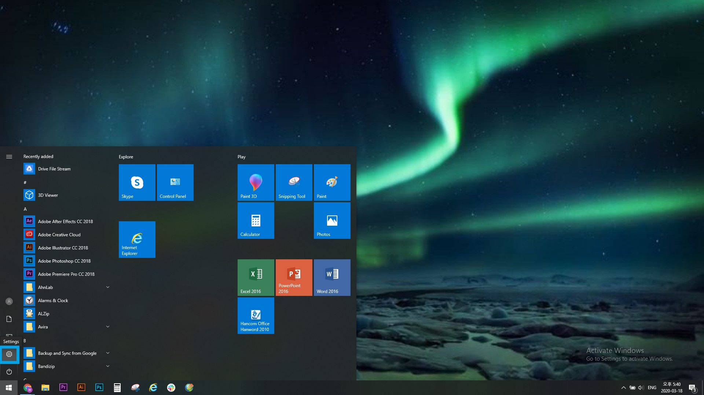
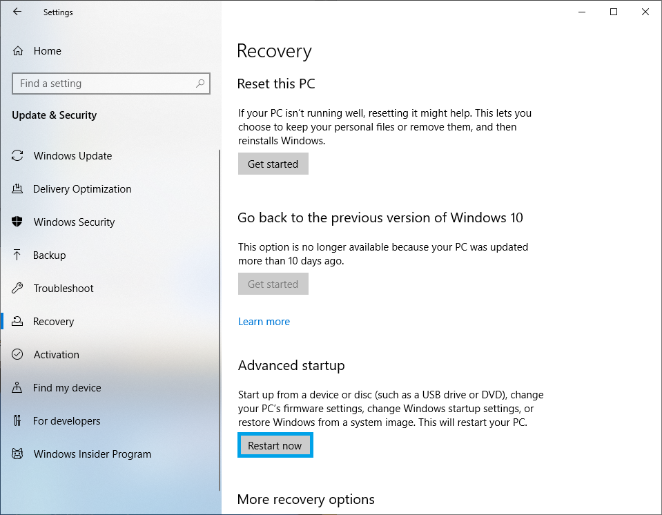
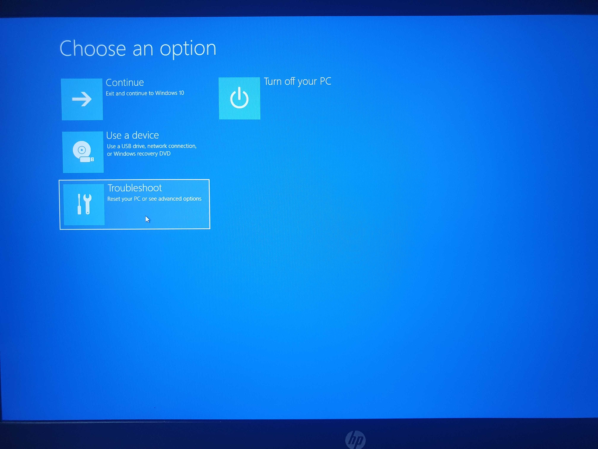
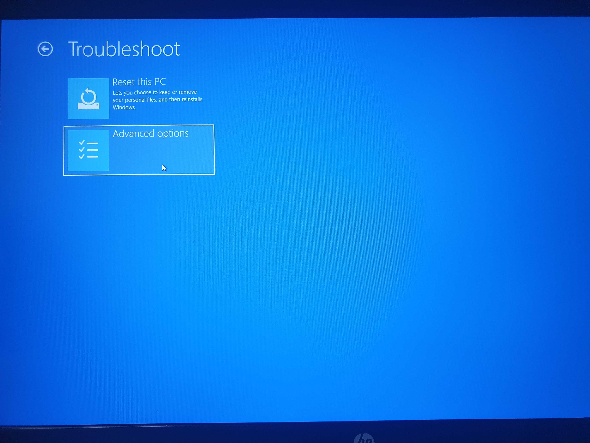
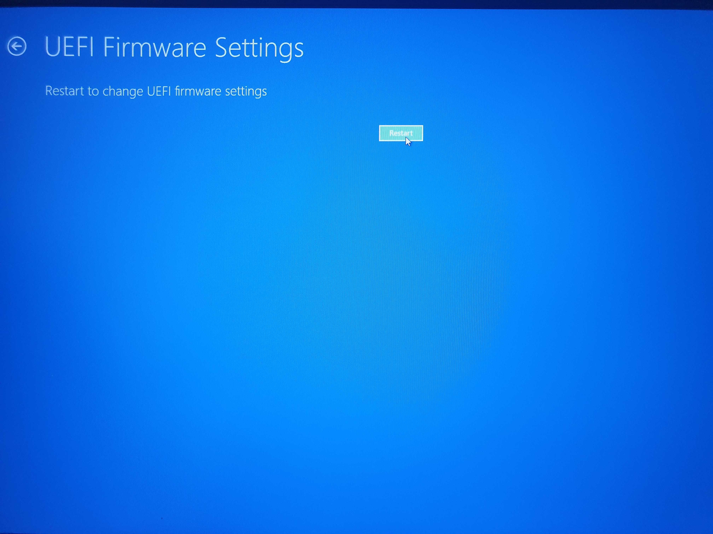

## Catatan
Dokumen asli: [booting_wayne_os.md](https://github.com/wayne-incorporated/wayne-os/blob/main/docs/en/how-to/booting_wayne_os.md)
 Dokumen ini mengharapkan kontribusi anda (dokumentasi, terjemahan, pelaporan, saran, pengkodean).

## 1. Untuk mengakses BIOS/UEFI
- Periksa koneksi disk lokal atau USB flash drive yang diinstal Wayne OS saat PC dalam keadaan dimatikan.
- Ketika PC dihidupkan, tekanlah tombol jari BIOS/UEFI yang bervariasi tergantung dari model PC dan manufaktur seperti contoh dibawah ini secara berulang kali.

| manufacturer     | Key    |
| ------ | ------ |
| HP     | 	F1 / F2 / F6 / F10 / F11 / F12 / ESC |
| Dell   | 	F1 / F2 / F3 / F12 / DEL / CTRL+ALT+ENTER / DEL+ESC / Fn+ESC / Fn+F1 |
| Lenovo | 	F1 / F2 / F12 / Fn+F2 / Enter-F1 / CTRL+ALT+F3 / CTRL+ALT+INC / Fn+F1|
| Acer   |  F1 / F2 / F10 / DEL / CTRL+ALT+ESC |
| Asus   | 	F2 / F10 / DEL / INSERT |
| Toshiba| 	F1 / F2 / F12 / ESC |
| Samsung|  F2 |
| Sony   |  F1 / F2 / F3 / ASSIST |
| MSI    | 	F2 / DEL |
| ASRock | 	F2 / DEL |
| ECS    |  DEL |
| Gigatbyte/Aorus| F2 / DEL |
| MS Surface Tablets| Press and hold volume up button |
| Origin |  F2 |
| Zorac  |  DEL|
### Alternatif lain untuk mengakses BIOS/UEFI di Windows 10
- Navigasi ke **settings** di menu Windows 10.

- Klik **Update & Security** di pengaturan di Windows.

- Pilih **Recovery** di panel bagian kiri.

- Klik **Restart now** yang terletak di bagian opsi Advanced startup (komputer akan memboot ulang).

- Klik **Troubleshoot** dan pilih Choose an option yang terdapat di layar.

- Klik **Advanced options**.

- Klik **UEFI Firmware Settings**.

- Klik **Restart** untuk konfirmasi.

## 2. Pengaturan BIOS/UEFI
- Ketika mengakses menu BIOS/UEFI, pilih USB anda menjadi urutan boot pertama.

- Matikan Secure Boot dan Fast Boot.
- Simpan pengaturan anda dan membooting ulang.

## 3. Memboot Wayne OS
- Wayne OS splash screen akan ditampilkan.
- Ketika memboot, konfigurasi bahasa, aksesibilitas, jaringan.
- Login dengan akun Google atau mode tamu.

## 4. Troubleshoot
- Perbarui BIOS/UEFI Anda.
- Jika anda masih tidak dapat membooting OS, diharapkan untuk melapor di [beragam_isu_yang_diketahui.md](https://github.com/wayne-incorporated/wayne-os/blob/main/docs/id/rilis/beragam_isu_yang_diketahui.md)
