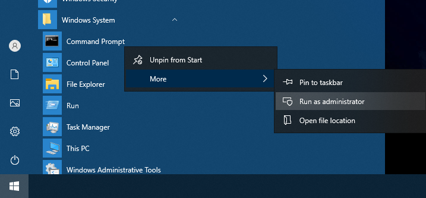

## Catatan
Dokumen asli: [initializing_usb_flash_drive.md](https://github.com/wayne-incorporated/wayne-os/blob/main/docs/en/how-to/initializing_usb_flash_drive.md)
 Dokumen ini mengharapkan kontribusi anda (dokumentasi, terjemahan, pelaporan, saran, pengkodean).

## Windows
Anda bisa menjalakan program Command Prompt sebagai administrator di Windows.

Catatan: 
fail sistem FAT32/exFAT direkomendasikanfile untuk USB.
 
FAT32 mendukung maksimum ukuran volum 32GiB dan maksimum ukuran fail 4GiB.
 
exFAT mendukung lebih dari ukuran volum 32GiB tetapi tidak bisa berfungsi di Windows XP (memerlukan perangkat tambahan).

## Linux
## Shell Linux, [Wayne OS Shell](https://github.com/wayne-incorporated/wayne-os/blob/main/docs/id/tata-cara/menggunakan_shell.md)
Pertama, hapus tabel partisi di USB.
 
`sudo dd if=/dev/zero bs=512 count=4096 of=/dev/${USB_FLASH_DRIVE}`
 
`${USB_FLASH_DRIVE}` harus berupa nama perangkat seperti sdx, bukan berupa nama perangkat seperti sdx1.
 
**Peringatan: Jika anda tidak sengaja menghapus nama penyimpanan lokal (cth: hdd/sdd), anda akan kehilangan data di penyimpanan lokal jadi mohon diperiksa nama perangkatnya secara teliti oleh lsblk.**
 
 
Selanjutnya anda bisa membuat tabel partisi baru, partisi dan sistem fail dengan alat pilihan anda. (cth: Gparted, parted, fdisk, gdisk, mkfs.fat, dll)
