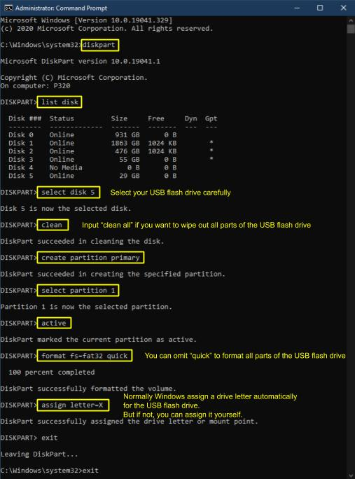

## 참고
이 문서는 여러분의 기여(문서 작성, 번역, 보고, 제안, 코딩)를 기다리고 있습니다.

## Windows
관리자 권한으로 명령 프롬프트를 실행할 수 있습니다.

참고: 
USB 플래시 드라이브에는 FAT32/exFAT 파일 시스템을 사용하는 것을 추천합니다.

FAT32는 최대 32GiB 볼륨 크기와 최대 4GiB 파일 크기를 지원합니다.

exFAT는 32GiB 이상의 볼륨 크기를 지원하지만 Windows XP에서는 작동하지 않습니다(추가 드라이버 필요).

## 리눅스 셸, [웨인 OS 셸](https://github.com/wayne-incorporated/wayne-os/blob/main/docs/en/how-to/using_shell.md)
먼저 USB 플래시 드라이브의 파티션 테이블을 제거합니다.
 
`sudo dd if=/dev/zero bs=512 count=4096 of=/dev/${USB_FLASH_DRIVE}`
 
`${USB_FLASH_DRIVE}` 는 sdx1과 같은 파티션 이름이 아닌 sdx와 같은 장치 이름이어야 합니다.
 
**경고: 로컬 스토리지(예: HDD/SSD) 이름을 잘못 입력하면 로컬 스토리지의 데이터가 손실되므로 `lsblk`로 이름을 주의 깊게 확인하시기 바랍니다.**
 
 
그런 다음 원하는 도구로 새로운 파티션 테이블, 파티션 및 파일 시스템을 만들 수 있습니다. ( 예: Gparted, parted, fdisk, gdisk, mkfs.fat 등)
