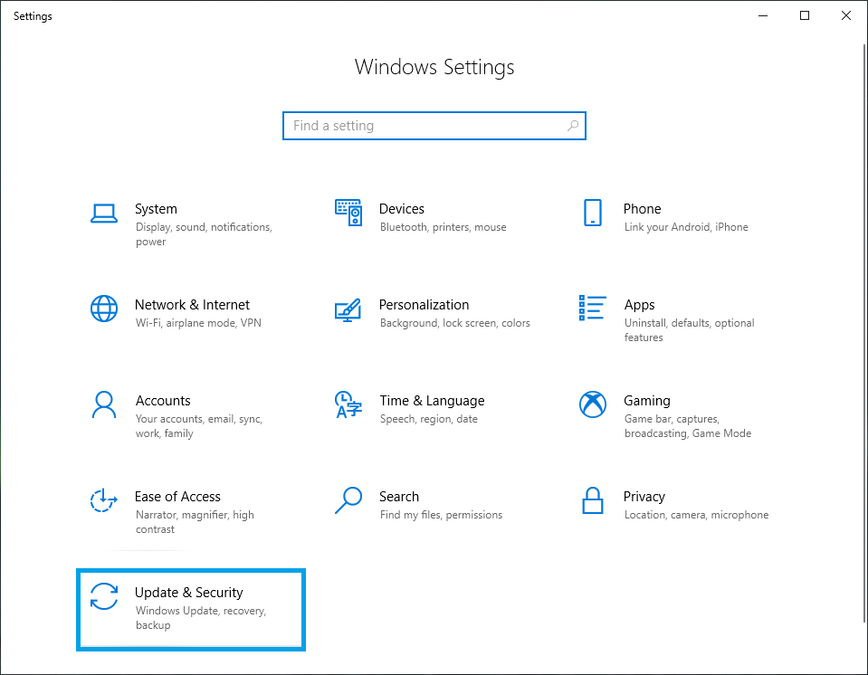

## 참고
이 문서는 여러분의 기여(문서 작성, 번역, 보고, 제안, 코딩)를 기다리고 있습니다.

## 1. BIOS/UEFI로 들어가려면
- PC가 꺼져 있을 때 웨인OS가 설치된 로컬 디스크 또는 USB 플래시 드라이브의 연결을 확인합니다.
- PC가 켜지면 아래 예시와 같이 PC 모델 및 제조업체에 따라 다른 BIOS/UEFI 진입 키를 반복해서 누릅니다.

| 제조업체     | 키    |
| ------ | ------ |
| HP     | 	F1 / F2 / F6 / F10 / F11 / F12 / ESC |
| Dell   | 	F1 / F2 / F3 / F12 / DEL / CTRL+ALT+ENTER / DEL+ESC / Fn+ESC / Fn+F1 |
| Lenovo | 	F1 / F2 / F12 / Fn+F2 / Enter-F1 / CTRL+ALT+F3 / CTRL+ALT+INC / Fn+F1|
| Acer   |  F1 / F2 / F10 / DEL / CTRL+ALT+ESC |
| Asus   | 	F2 / F10 / DEL / INSERT |
| Toshiba| 	F1 / F2 / F12 / ESC |
| Samsung|  F2 |
| Sony   |  F1 / F2 / F3 / ASSIST |
| MSI    | 	F2 / DEL |
| ASRock | 	F2 / DEL |
| ECS    |  DEL |
| Gigatbyte/Aorus| F2 / DEL |
| MS Surface Tablets| 볼륨 높이기 버튼을 길게 누릅니다. |
| Origin |  F2 |
| Zorac  |  DEL|

#### Windows10에서 BIOS/UEFI로 들어가는 다른 방법
- Windows 10 시작 메뉴에서 **설정**으로 이동합니다.

- Windows 설정에서 **업데이트 및 보안**을 클릭합니다.

- 왼쪽 창에서 **복구**를 선택합니다.

- 고급 시작 헤더 아래의 **지금 다시 시작**을 클릭합니다(컴퓨터가 재부팅됩니다).

- 블루 스크린이 있는 옵션 선택에서 **문제 해결**을 클릭합니다.

- **고급 옵션** 클릭

- **UEFI 펌웨어 설정**을 클릭합니다.

- **재시작**을 클릭하여 확인

## 2. BIOS/UEFI 설정
- BIOS/UEFI 메뉴에 들어가면 USB 플래시 드라이브를 부팅 순서 1번으로 설정합니다.

- 보안 부팅 및 빠른 부팅 끄기
- 설정을 저장하고 재부팅

## 3. OS 시작
- 웨인OS 스플래시 화면이 표시됩니다.
- 부팅 후 언어, 접근성, 네트워크를 구성합니다.
- 구글 계정 또는 게스트 모드로 로그인

## 4. 문제 해결
- BIOS/UEFI를 업데이트합니다.
- 그래도 OS를 부팅할 수 없는 경우 [알려진_문제.md](https://github.com/wayne-incorporated/wayne-os/blob/main/docs/kr/출시/알려진_문제.md)에 신고하세요.
