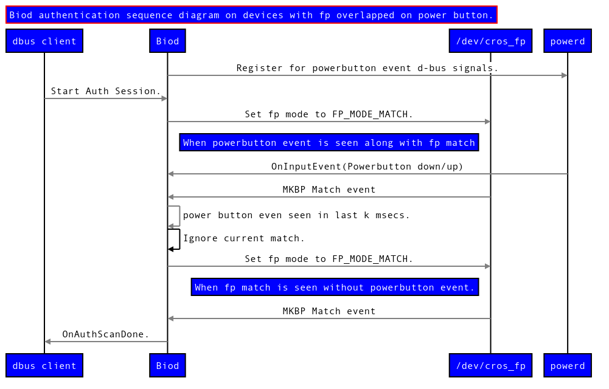

# `biod`: Biometrics Daemon

`biod` (Biometrics Daemon) is a daemon for enrolling, authenticating and
managing biometrics data for faster unlocking. It manages all biometric sensors
for all users of the device.

[TOC]

## Keywords

**Record**: specific piece of biometric data that a user registers along with
its metadata.

**Enroll**: the act of registering a record.

**EnrollSession**: the session during which enrolling of a record happens.

**Authenticate**: the act of checking a new piece of biometric data against
stored records.

**AuthSession**: the session during which authenticating a new piece of
biometric data against stored records happens.

**BiometricsManager**: manager for a piece of device/hardware/sensor for
collecting a specific type of biometric data. Each `BiometricsManager` is in
charge of storing the records that it enrolled.

## Building

For more context, see the [Chromium OS Developer Guide].

*   Start working on the `biod` package:

    ```bash
    (chroot) $ cros_workon-<board> start biod
    ```

*   Build `biod`:

    ```bash
    (chroot) $ emerge-<board> biod
    ```

*   Deploy `biod` to your `DUT`:

    ```bash
    (chroot) $ cros deploy ${DUT_IP_ADDR} biod
    ```

    As a shortcut, you can also `scp` the `biod` binary to your DUT.

## Running

`biod` is controlled by `upstart`.

### Start biod

```bash
(dut)$ start biod
```

### Stop biod

```bash
(dut)$ stop biod
```

### Check whether biod is running

```bash
(dut)$ status biod
```

## Logs

`biod`'s logs are written to `/var/log/biod/biod.LATEST`.

## Unit Tests

The unit tests can be run with the following command:

```bash
(chroot)$ FEATURES=test emerge-<board> biod
```

## Manual Testing

You can add and remove fingerprints from the UI by navigating to
`chrome://os-settings` in Chrome and searching for "fingerprint" in the search
bar. Selecting the "Fingerprint settings" option will load the page for adding
and removing fingerprints.

## Storage

The records are stored under the directory:
`/home/root/[hash_of_user_id]/biod/[name_of_biometrics_manager]/` with the file
name: `Record[UUID]`.

UUID has the form of `XXXXXXXX_XXXX_XXXX_XXXX_XXXXXXXXXXXX` where `X` represents
a lowercase hex digit. UUID is a 128-bit random number generated with `guid`, so
it is highly unlikely to repeat. `_` are used instead of `-` because this UUID
is used in biod D-bus object paths, which do not allow `-`.

Each record file is stored in JSON format, and contains one record and its
record id and label.

## Firmware Updates

The [`bio_fw_updater`] tool is responsible for updating the [FPMCU firmware]\
[automatically on boot]. The updater checks to see if the firmware binary in
`/opt/google/biod/fw` matches the firmware that is flashed on the FPMCU and
performs an update if the two do not match. Note that it does not consider
whether the version of the firmware is semantically "newer"; it's strictly
checking for an exact version match.

To disable the automatic update, you can create the `.disable_fp_updater` file
in the stateful partition:

```bash
(dut) $ touch /mnt/stateful_partition/.disable_fp_updater
```

For security reasons this will work only when we are allowed to boot developer
mode from unsigned kernels (`crossystem dev_boot_signed_only` reports 0).

When hardware and [software write protect] for the FPMCU are enabled,
[`bio_fw_updater`] will only update the RW portion of the firmware.

When devices are still under development, they will generally have
[hardware write protect] enabled, but not software write protect. In this mode,
[`bio_fw_updater`] will update both RO and RW.

You can learn more about write protection and how to enable/disable in the
[Firmware Write Protection] documentation.

### Logs

[`bio_fw_updater`]'s logs are written to:

*   `/var/log/biod/bio_fw_updater.LATEST`
*   `/var/log/biod/bio_fw_updater.PREVIOUS`
*   `/var/log/biod/bio_fw_updater.<TIMESTAMP>`
*   `/var/log/bio_fw_updater.out`

## Hardware

### CrosFpBiometric

CrosFpBiometric (fingerprint MCU) runs the firmware for image capture, matching
and enrollment. Biod (`cros_fp_biometrics_manager.cc`) interacts with the MCU by
doing system calls on `/dev/cros_fp`.

#### Authentication

On receiving an Authentication request, biod makes a ioctl call to put the MCU
in FP_MODE_MATCH. It then listens for MBKP events from the MCU. On receiving the
event, based on the result, biod either reports success or failure to the D-bus
client (typically Chrome).

Things get little complicated on devices with fingerprint overlapped on power
button. On these devices, we need to be careful not to interpret user's
interaction with power button as an intent to authenticate via fingerprint. To
avoid such scenarios, we ignore fingerprint matches if we have seen a power
button event in last few milliseconds. To achieve this, biod keeps track of
power button events (`power_button_filter.cc`) by listening to d-bus events
advertised by powerd (`power_manager.cc`). The sequence diagram below gives a
sequence of events on devices with fingerprint overlapped on power button.



#### Enrollment

<!-- mdformat off(b/139308852) -->
*** note
TODO
***
<!-- mdformat on -->

## Chrome

Biod communicates with Chrome via D-bus messages. Chrome provides the graphical
interface for users to enroll new biometric data and manage their own records.
Chrome is also responsible for the visual display during authentication.

## Login Manager

When a user logs in or biod starts, biod will ask login manager for a list of
currently logged-in users, and load from storage the records of the newly
logged-in users.

When a user logs out, all users log out at the same time, biod receives a signal
from login manager and remove all records in the memory.

## Cryptohome

Because the records are stored in per user stateful under
`/home/root/[hash_of_user_id]`, they are naturally encrypted by cryptohome.
Records are encrypted when the users log out and decrypted when the users log
in. Cryptohome provides a layer of security to biod.

## Testing Tools

### biod_client_tool

`biod_client_tool` provides the interface to fake the behavior of a biometrics
client, for example, a lock screen or a biometric enrollment app. It can be used
to test biod and biometric sensors. Use the `--help` flag to see the options.

## D-Bus API

**Service Name**: `org.chromium.BiometricsDaemon`

**Root Object**: `/org/chromium/BiometricsDaemon`

The root object implements the `org.freedesktop.DBus.ObjectManager` interface
which should be used to enumerate the available biometric devices. Each
biometric device implements the
`org.chromium.BiometricsDaemon.BiometricsManager` interface, which is used to
retrieve previously made records or to start an `Enroll` or `Authenticate`
session. `Enroll` sessions are for making new records. `Authenticate` sessions
are for authenticating scanned biometric data against those previously made
records. Each session object can be used to end the session, but signals still
go through the BiometricsManager object to avoid a race condition between
starting a session and connecting to the session's signals. Something to note
about the session objects is that they will automatically be ended when the
D-Bus client that created them (whomever called `StartEnrollSession` or
`StartAuthSession`). This is to prevent the `BiometricsManager` from entering a
stuck state in case the client crashes and nobody comes around to end the
session. This shouldn't be an issue unless one expects the session to continue
after the D-Bus client disconnects, for example while testing out `biod` using
`dbus-send` or other single shot command line dbus tool. Each
`BiometricsManager` can have only one session running concurrently.

### org.chromium.BiometricsDaemon.BiometricsManager

#### StartEnrollSession (Method)

```
StartEnrollSession(in STRING user_id, in STRING label, out OBJECTPATH enroll_session)
```

*   `user_id` refers to the sanitized user name returned by [SanitizeUserName]
    in libbrillo.

*   `label` is an arbitrary string chosen to be human readable by the user.

*   The returned `enroll_session` object path implements the
    `org.chromium.BiometricsDaemon.EnrollSession` interface, but
    `EnrollScanDone` and `SessionFailed` signals still come from this
    `BiometricsManager`.

#### GetRecords (Method)

```
GetRecords(out ARRAY<OBJECTPATH> records)
```

Each returned object path implements the `org.chromium.BiometricsDaemon.Record`
interface.

#### DestroyAllRecords (Method)

```
DestroyAllRecords()
```

#### StartAuthSession (Method)

```
StartAuthSession(out OBJECTPATH auth_session)
```

The returned object path implements the
`org.chromium.BiometricsDaemon.AuthSession` interface, but `AuthScanDone` and
`SessionFailed` signals still come from this `BiometricsManager`.

#### EnrollScanDone (Signal)

```
EnrollScanDone(UINT32 scan_result, BOOL complete)
```

If `complete` is true, the enrollment was successfully finished and saved.

The `UINT32 scan_result` values are meant to be instructions to the user on how
to get a better scan. They are as follows:

Note: Pretty much ripped off from AOSP's `fingerprint_acquired_info` in
[fingerprint.h](https://cs.android.com/android/platform/superproject/+/master:hardware/libhardware/include/hardware/fingerprint.h;l=67;drc=1ae7379baab4b2941ad1701190718cf53a051b48).
Codes which are greater or equal to 10000 are ChromeOS specific codes.

*   0 = Success (the sensor captured good data)
*   1 = Partial (sensor needs more data)
*   2 = Insufficient (too little detail for recognition)
*   3 = Sensor Dirty
*   4 = Too Slow (tell user to speed up)
*   5 = Too Fast (tell user to slow down)
*   6 = Immobile (tell user to move a little to get more data)
*   10000 = No Match (tell user to use another finger, used during authentication)

#### AuthScanDone (Signal)

```
AuthScanDone(FingerprintMessage message, std::unordered_map<std::string, std::vector<std::string>> matches)
```

The returned `message` is a protobuf which is the union of ScanResult enum and
FingerprintError enum. ScanResult is used to give user a feedback about
scanning. FingerprintError is used to provide more details when matching fails
but is's not related to user.

Note: Codes for FingerprintError comes from AOSP's `fingerprint_error` in
[fingerprint.h](https://cs.android.com/android/platform/superproject/+/master:hardware/libhardware/include/hardware/fingerprint.h;l=48;drc=1ae7379baab4b2941ad1701190718cf53a051b48).
Codes which are greater or equal to 10000 are ChromeOS specific codes.

*   1 = HW Unavailable (general hardware error)
*   2 = Unable To Process (operation can't continue)
*   3 = Timeout (operation has timed out waiting for user input)
*   4 = No Space (no space to store the template)
*   5 = Canceled (operation can't proceed)
*   6 = Unable To Remove (fingerprint with given ID can't be removed)
*   7 = Lockout (hardware is locked due to too many attempts)
*   10000 = No Templates (fingerprint hardware contains no templates)

The returned `matches` are a map from user id to a list of biometric record ids.
The user ids are the same ones given to `StartEnrollSession` in previous enroll
sessions. Each user in the list have one or more records that indicate a match.
Note that a piece of biometric data could be registered multiple times under the
same or different users.

#### SessionFailed (Signal)

```
SessionFailed()
```

General failure of enroll session and/or authenticate session that can not be
recovered from

#### StatusChanged (Signal)

```
StatusChanged(BiometricsManagerStatusChanged status)
```

The signal is emitted when status of Biometrics Manager changes. It contains
a `status` protobuf which contains BiometricsManagerStatus enum.

The enum contains following entries:

*   1 = Initialized (ready for Enroll/Auth Session)

#### Type (Property)

```
UINT32 Type
```

`Type` has one of the following values:

*   0 = Unknown
*   1 = Fingerprint

### org.chromium.BiometricsDaemon.AuthSession

#### End (Method)

```
End()
```

Ends the authentication session and destroys this object path. Generally, the
client should call this at some point because authentication sessions do not end
on their own, unless there is some error.

### org.chromium.BiometricsDaemon.EnrollSession

#### Cancel (Method)

```
Cancel()
```

Ends the enroll session without storing the enrollment and destroys this object
path. Generally, the client **should not** call this as the Enroll session will
end automatically once enough data is collected. Exceptions to this rule being
that there was some error on the client side, the user explicitly canceled the
session, or the client has determined the user to have given up, perhaps after
some timeout has elapsed.

### org.chromium.BiometricsDaemon.Record

#### Remove (Method)

```
Remove()
```

Deletes this record object from memory and persistent storage. It will no longer
participate in any future Authenticate sessions.

#### SetLabel (Method)

```
SetLabel(in STRING label)
```

Sets the human readable label of this `Record` object.

#### Label (Property)

```
STRING Label
```

Read-only property that gets the previously set (by either `StartEnrollSession`
or `SetLabel`) human readable label of this record object.

### Example API Usage

The symbol **`<-`** means Chrome sends the command to
`org.chromium.BiometricsDaemon`

The symbol **`->`** is either a response or a signal from
`org.chromium.BiometricsDaemon`

1.  Logged in user clicks enroll in UI:

    ```
    <- Object:/org/chromium/BiometricsDaemon Method:org.freedesktop.DBus.ObjectManager.GetManagedObjects
    ->  [
         "/org/chromium/BiometricsDaemon/BiometricsManager0"
        ]
    <- Object:/org/chromium/BiometricsDaemon/BiometricsManager0 Method:org.chromium.BiometricsDaemon.BiometricsManager.StartEnrollSession "<user id hash>" "Data 1"
    -> "/org/chromium/BiometricsDaemon/BiometricsManager0/EnrollSession"
    ```

2.  User presses finger onto sensor

    ```
    -> org.chromium.BiometricsDaemon.BiometricsManager.EnrollScanDone (Success) false
    ```

3.  Chrome UI shows encouraging message about that scan to user

4.  User presses finger again but too quickly

    ```
    -> org.chromium.BiometricsDaemon.BiometricsManager.EnrollScanDone (Too Fast) false
    ```

5.  Chrome UI shows a stern message about how the user's finger is too fast.

6.  [...] Continued until biod determines there is enough data

    ```
    -> org.chromium.BiometricsDaemon.BiometricsManager.EnrollScanDone (Success) true
    ```

7.  Chrome displays successful enrollment message

8.  Logged in user locks screen

    ```
    <- Object:/org/chromium/BiometricsDaemon/BiometricsManager0 Method:org.chromium.BiometricsDaemon.BiometricsManager.StartAuthSession
    -> /org/chromium/BiometricsDaemon/BiometricsManager0/AuthSession
    ```

9.  User does a scan with dirty sensor and lock screen informs the user of this

    ```
    -> org.chromium.BiometricsDaemon.BiometricsManager.AuthScanDone (Sensor Dirty) [empty array]
    ```

10. User cleans sensor and tries again with success

    ```
    -> org.chromium.BiometricsDaemon.BiometricsManager.AuthScanDone (Success) ["unordered_map<string user_id, vector<string record_id>>"]
    ```

11. Lock screen lets user in

[Chromium OS Developer Guide]: https://chromium.googlesource.com/chromiumos/docs/+/HEAD/developer_guide.md#Making-changes-to-packages-whose-source-code-is-checked-into-Chromium-OS-git-repositories
[SanitizeUserName]: ../libbrillo/brillo/cryptohome.h
[`bio_fw_updater`]: ./tools/bio_fw_updater.cc
[FPMCU firmware]: https://chromium.googlesource.com/chromiumos/platform/ec/+/HEAD/docs/fingerprint/fingerprint.md
[hardware write protect]: https://chromium.googlesource.com/chromiumos/platform/ec/+/HEAD/docs/write_protection.md#hw_wp
[software write protect]: https://chromium.googlesource.com/chromiumos/platform/ec/+/HEAD/docs/write_protection.md#software-write-protect
[automatically on boot]: ../init/upstart/boot-update-firmware.conf
[Firmware Write Protection]: https://chromium.googlesource.com/chromiumos/platform/ec/+/HEAD/docs/write_protection.md
