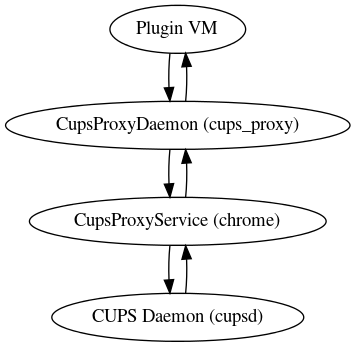

# CUPS Proxy Daemon

## Summary

The CUPS Proxy Daemon is responsible for parsing HTTP(S) requests from the VM’s
file socket ([`/run/cups_proxy/cups.sock`][1]) and passing that to the `CupsProxyService`
in Ash Chrome via Mojo. It also relays the HTTP(S) response generated by `CupsProxyService`
back to Plugin VM.

The control flow is as follows:

The Mojo IPC channel is [bootstrapped][2] via the `org.chromium.CupsProxyDaemon` D-Bus service.

libmicrohttpd is used to parse (and validate) HTTP(S) requests.

The HTTP(S) requests are actually IPP(S) requests - validation of the IPP(S) part
of the protocol is performed by the CUPS Proxy Service.

## Design docs

* Overall design: [go/cups-proxy-daemon]

[1]: https://source.chromium.org/chromiumos/chromiumos/codesearch/+/main:src/platform2/cups_proxy/daemon.cc;drc=713061ea4d4c8d9538b7e893b1acfa3bea2a331d;l=28
[2]: https://source.chromium.org/chromium/chromium/src/+/main:chromeos/dbus/cups_proxy/cups_proxy_client.h
[go/cups-proxy-daemon]: http://go/cups-proxy-daemon
