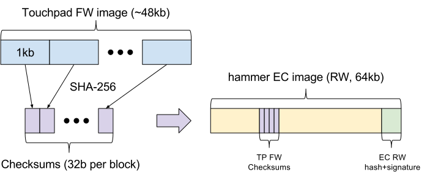

# Hammer: Secure touchpad firmware

## Summary

hammer runs its own upgradable firmware (base EC, running EC codebase on
STM32F072), is attached to a touchpad, with its own upgradeable FW.

Touchpad FW is too large to fit into base EC flash, so it needs to be
sent over from the AP. For security reasons, we need to have base EC verify
touchpad FW integrity before updating it.

## Touchpad FW verification on base EC

We ship hashes of touchpad FW in base EC RW (so the checksums are verified as
part of EC RW verification), then base EC verifies blocks one by one before
flashing them.

* We split the touchpad FW into blocks of X kb (currently X=1), which can,
  individually, easily fit in EC RAM. For each of these blocks, we compute
  a SHA-256 checksum (32-byte per block, so 1536 bytes in total for a 48kb
  image with X=1).
* We ship the checksums as part of the base EC RW image, so that they are
  signed/verified as part of the verified boot process of base EC.
* To update touchpad FW, we follow these steps:

   * AP checks that touchpad FW needs to be updated (by comparing versions).
   * AP verifies that complete touchpad FW hash matches the touchpad FW whose
     hashes are stored in EC image (prevents issues with mismatching FW).
   * AP sends block of X kb (using existing USB updater protocol, but at a
     custom "virtual" address indicating we want to flash the touchpad FW).
   * EC verifies SHA-256 sum of the block against stored checksum.
   * If valid, EC updates X kb block over I2C.

## Updating touchpad FW image in firmware and release branches

Updating the touchpad FW image requires extra care, as it needs to be provided
both in the firmware branch (to compute the hashes to be embedded in the EC
image), and in the release branch (so that hammerd can read the touchpad FW
image and send it to base EC).

On firmware branch (note that if `USE=bootimage` is set, firmware branch steps
should first be followed on the release branch):

1. Update the touchpad FW (e.g. [CL:*444536](https://crrev.com/i/444536), to be
   installed in `/firmware/hammer/<product_id>_<firmware_version>.bin` (this
   filename matches current [touch firmware updater convention](https://www.chromium.org/chromium-os/chromiumos-design-docs/touch-firmware-updater#TOC-Userspace-organization-and-scripts).
   Also, this ebuild must create a symlink from `/firmware/hammer/touchpad.bin`
   to the actual touchpad firmware above.
2. `chromeos-ec` ebuild picks up the new touchpad FW
   ([CL:643006](https://crrev.com/c/643006)), and EC build system will generate
   hashes ([CL:615321](https://crrev.com/c/615321)), to be included in hammer
   EC image (this is what allows hammer to check touchpad FW validity at
   runtime).
3. Builder signs hammer EC image, and outputs `firmware_from_source.tar.bz2`
   tarball that contains `/firmware/hammer/<product_id>_<firmware_version>.bin`
   and the symlink `/firmware/hammer/touchpad.bin`.

On release branch:

1. Update `chromeos-firmware-hammer` ebuild to install the new EC image
   (`/lib/firmware/hammer.fw`), as well as the new touchpad firmware
   (`/opt/google/touchpad/firmware/<product_id>_<firmware_version>.bin`), both
   coming from firmware branch builder artifacts (similar to
   [CL:*438992](https://crrev.com/i/438992)). The ebuild also creates a symlink
   from `/lib/firmware/hammer-touchpad.fw` to the actual touchpad firmware
   above. Doing this update in one single CL avoids possible mismatch between
   touchpad FW provided in release image and stored hashes in EC image.
2. At runtime, hammerd will use both images to first update hammer EC, then
   update the touchpad FW, as required.
