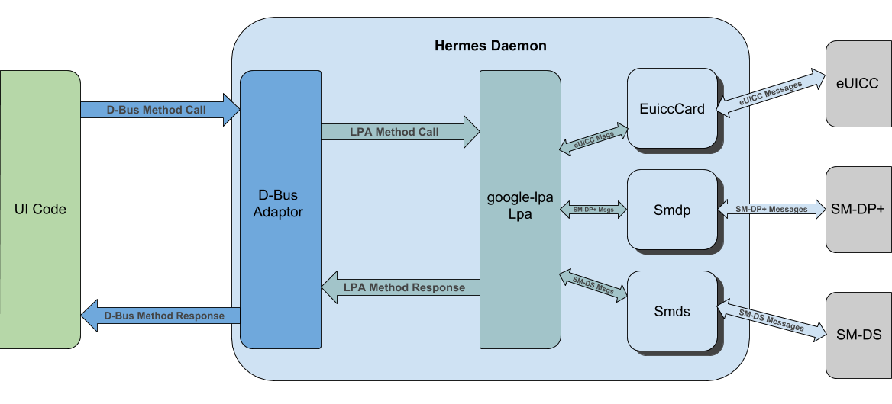

# hermes: eSIM Daemon

## Summary

This daemon provides support for the downloading and managing of cellular
profiles for eUICCs.

## eSIM Background

The SIM (Subscriber Identity Module) card is a piece of hardware that serves to
identify and authenticate subscribers of mobile networks. Traditionally, SIM
cards were physically removable cards that were programmed with an
operator-specific **profile** during the manufacturing process. These profiles
contain the necessary data to satisfy the central duties of identification and
authentication. More recently, SIM cards were split between a physical component
and a SIM application. This physical component is known as a UICC (Universal
Integrated Circuit Card), and is essentially a small, secure computer in the
form of a smart card. SIM applications, such as the USIM application for UMTS
networks or the CSIM application for CDMA2000 networks, are then run on the UICC
in order to produce a fully-functioning SIM solution. Despite this change, there
can still only be a single profile provisioned with the application in question,
and such provisioning cannot occur remotely.

An **eUICC**, or embedded UICC, seeks to rectify these shortcomings by allowing
both for the storage of multiple profiles and for the remote provisioning of
profiles. As users no longer physically interact with operators to be
provisioned a profile, the architecture for profile provisioning is quite
different. Two main entities involved with remote profile provisioning are the
**SM-DP+** (Subscription Manager - Data Preparation) and **SM-DS** (Subscription
Manager - Discovery Server).

The SM-DP+ is responsible for the creation and management of profiles, as
required by the network operator. It is also responsible for the secure delivery
of profiles to eUICCs. The SM-DP+ is generally, although not necessarily, owned
by a particular operator, meaning that there can be many SM-DP+s for an eUICC
to potentially communicate with in a wide deployment scenario.
>   Note: For those diving into specifications and articles (or those curious as
>   to why the SM-DP+ has a "+"), there are actually two remote SIM provisioning
>   solutions. One is designed for M2M (machine-to-machine) use-cases, in which
>   the mobile device is generally not locally controlled by a user. The other
>   solution is designed for consumer products in which the mobile device is
>   expected to be locally controlled by the user, and therefore shouldn't
>   perform actions without the consent/input of the user. Despite many
>   similarities in the architectures of these two solutions, one difference is
>   that the M2M solution has an SM-DP, which is still responsible for creating
>   and managing profiles but is *not* responsible for the secure transport of
>   bound profiles. A separate entity called the **SM-SR** (Subscription
>   Manager - Secure Routing) takes on that responsibility. The consumer
>   solution, whose specification came afterwards, combined both roles into a
>   single entity that was christened "SM-DP+". Unless otherwise specified, the
>   information in this document refers specifically to that of the consumer
>   remote provisioning architecture.

One way for an eUICC to download a profile is to have a hard-coded address to a
default SM-DP+ that can serve some profiles. This approach is common when a
device is sold by a particular operator, who sets the default SM-DP+ address to
that of their own SM-DP+. Since an eUICC may be provisioned multiple profiles
from potentially multiple different SM-DP+s, though, this solution is not
sufficient in general. SM-DS entities exist to provide a more flexible solution,
allowing an arbitrary SM-DP+ to inform an eUICC that a profile is availble
for download.

SM-DS servers are organized hierarchically, not unlike how DNS name servers are
organized. The eUICC contains the address of a unique root SM-DS server, and
polls that SM-DS server periodically (or only when the user manually triggers a
poll, depending on how the user has configured their system). When an SM-DP+
generates a new profile, as per the request of an operator, it will push an
**Event Record** to an SM-DS server. This Event Record contains the unique ID of
the eUICC the profile was created for and the address of the SM-DP+ server. If
the Event Record was pushed to the root SM-DS, then the process is
complete. Otherwise, the recieving SM-DS creates a new Event Record containing
the unique ID of the eUICC and *its* address and sends the resulting Event
Record to the parent SM-DS server, in a recursive process that ends at the root
SM-DS server. In this way, any eUICC can determine if an SM-DP+ has a profile
for it to download, and can determine the address of that SM-DP+ server, by
first communicating only with the root SM-DS.

Local control of the eUICC to allow for such behavior as downloading/removing
profiles and switching between profiles is provided by a set of functionality
called the **LPA** (Local Profile Assistant). The LPA is composed of three
groups of functionality:
*   **LPD** (Local Profile Download), which essentially serves as a bridge
    between the SM-DP+ and eUICC. It is responsible for downloading bound
    profiles from the SM-DP+, segmenting the profiles, and passing the segments
    to the eUICC.
*   **LDS** (Local Discover Service), which is responsible for pulling relevant
    Event Records from the root SM-DS. When retrieving an Event Record that
    points to another SM-DS server rather than directly to an SM-DP+, the LDS is
    also responsible for recursively communicating with the child SM-DS servers
    (also known as **Alternative SM-DS**s) until the relevant SM-DP+ address is
    determined.
*   **LUI** (Local User Interface), which provides the user interface that
    allows for the local use of profile management functions.

## Design

Hermes exists to implement LPA services and to provide such services, through a
D-Bus interface, to ChromeOS UI code.

The [remote provisioning spec] specifies the content and format of messages sent
between entities using an interface description language known as ASN.1. Of
particular interest to us are the interfaces between the LPA and other entities
(e.g. SM-DP+, SM-DS, ISD-Ps on the eUICC). The google-lpa library takes the
specification-compliant message flow for these interfaces and provides clients
with an API consisting instead of logical method calls. It is the responsibility
of google-lpa clients to implement the means of data transport (HTTPS
communication with SM-DP+ and SM-DS, and hardware-specific communication with
the eUICC). It is also the responsibility of google-lpa clients to implement the
LUI, which in the case of Hermes is achieved by exposing a D-Bus interface that
is used by the ChromeOS UI.

The figure below displays the high-level architecture of the Hermes daemon:

The major components of the daemon are thus a D-Bus apaptor, a google-lpa Lpa
instance, and data transport classes for communicating with different eUICCs,
SM-DP+s, and SM-DSs, labeled respectively as EuiccCard, Smdp, and Smds. When a
user triggers an LPA method from the UI, a method call is sent to the D-Bus
object exposed by the Hermes daemon. This D-Bus method call is then converted by
the D-Bus adaptor into a suitable call or set of calls on the Lpa instance. The
Lpa instance sends and receives messages to the eUICC, SM-DP+, and SM-DS as
necessary to achieve the desired result, using the corresponding EuiccCard,
Smdp, and Smds instances for data transport. As there are potentially multiple
data transport classes for a particular entity (e.g. a class for communicating
with eUICCs by using the UIM QMI service over QRTR vs a class for communicating
with eUICCs by using the MBIM protocol over USB), Hermes provides the Lpa
instance with the proper transport classes on startup. Finally, the Lpa method
responses are converted into a D-Bus method response and are sent back to the UI
code.

[remote provisioning spec]: https://www.gsma.com/newsroom/wp-content/uploads/SGP.22_v2.2.pdf
