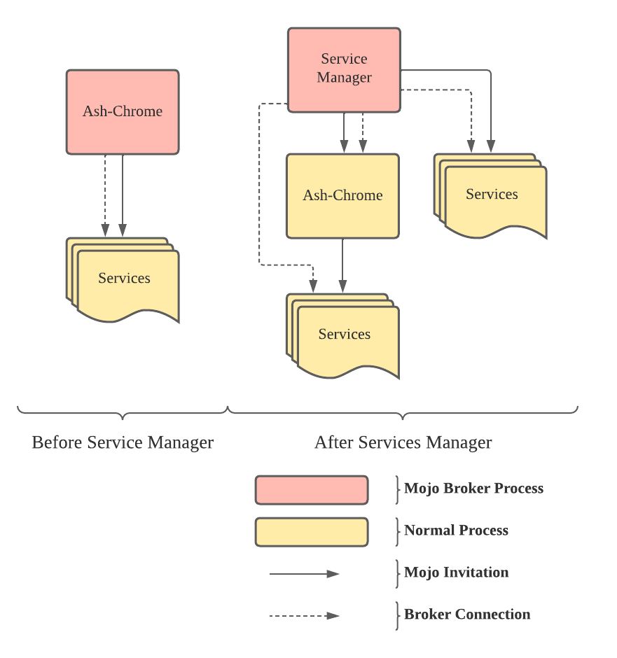

# Mojo Service Manager

The mojo service manager provides interface for services to register and to
request mojo interfaces. It makes the sharing of mojo interfaces across
processes easy.

[TOC]


## Motivation

**TL;DR, it is a service which can simplify the bootstrap process of mojo.**

For detail design, see
[go/cros-mojo-service-manager](http://go/cros-mojo-service-manager)
(Googlers only).

### No Need to Use D-Bus

Before the service manager was introduced, we used D-Bus to bootstrap mojo
connections. The users need to deal with the underlying mojo API and exchange
a file descriptor by a D-Bus service.

Service manager provides an unix socket to bootstrap mojo. No need to use D-Bus
for bootstrap anymore.

### Implicit Mojo Bootstrap

Service manager provides an easy to use API to bootstrap and exchange mojo
interfaces. It wraps the mojo invitation process. The users don't need to handle
the mojo bootstrap and can focus on the mojo service itself.

### No Factory Interface

In the old flow, each process usually bootstrapped the connection to each
related process only once through D-Bus.
Thus, we used to create a "factory interface" for a mojo connection:

```mojom
interface ServiceFactory {
  // Pass receivers to access the services provided by the callee of
  // ServiceFactory.
  BindServiceA(pending_receiver<ServiceA> receiver);
  BindServiceB(pending_receiver<ServiceB> receiver);

  // Pass remotes so the callee of ServiceFactory can use them to access the
  // service provided by the caller of ServiceFactory.
  SendServiceC(pending_remote<ServiceC> remote);
  SendServiceD(pending_remote<ServiceD> remote);
}
```

It was used to exchange other mojo interfaces later.
This was for decoupling the bootstrap of these services from the mojo
invitation.

With service manager, this can be replaced by services registering / requesting.

### Pending Before Services Available

In the old flow it was difficult to handle mojo requests before the service
being available.
Some reasons that we had this situation:

* Waiting for a D-Bus service to be available. The mojo remote can only be bound
  after that.
* The caller needs to wait for the callee to send the mojo remote.
  We have such design in our codebase due to some underlying mojo limitations we
  used to have.
  For example, in the above `ServiceFactory`, we can see the caller of
  `ServiceC` needs to wait for the callee to send the mojo remote.

With service manager, the services bootstrap is decoupled from the mojo
invitation.
Callers can always send the mojo receiver instead of waiting for a mojo remote.
If the service is not yet registered, the service manager will push the request
to a queue and will bind it after the service is available.
Users just need to request the service. The mojo remote holds all the method
calls until the corresponding pending receiver is bound. And the service manager
holds the pending receiver until the service is registered.

### Access Control by SELinux Security Context

A json format policy file is used to describe the ACL. It controls which
identity can register / request which services.
An identity is a SELinux security context. A service is a mojo interface.

In the old flow, we only had ACL based on uid / gid by D-Bus.
All the interfaces were bound to a D-Bus service so we couldn't separate them.
Now, each process can have a different security context, and each mojo interface
can be registered / requested separately.
This means we can have a processes level and mojo interfaces level ACL.

### Decoupling from Ash-Chrome Lifecycle



The lifetime of a process using mojo is decoupled from ash-chrome.

Before the service manager, ash-chrome was the mojo broker process which helps
other processes to bootstrap. All the mojo connection should be shutdown after
the broker is gone. Since ash-chrome restarts between user sessions, mojo
connections between processes couldn't outlive the current user session.

The service manager now becomes the broker process. All the processes connected
to service manager can keep their mojo connections until reboot.

## Usage

For the usage in chromium repo, see [chromium's document](https://chromium.googlesource.com/chromium/src/+/HEAD/chromeos/ash/components/mojo_service_manager/README.md).

### Bootstrap

To use service manager, a process needs to bootstrap the mojo and obtains the
service manager mojo interface.

*   ChromiumOS services

    * Add the package dependency to the ebuild of your package. Example:
    https://crrev.com/c/3865050
    * Add `mojo_service_manager` to the pkg_config in BUILD.gn. Example:
    [source](https://source.chromium.org/chromium/chromiumos/platform2/+/main:diagnostics/cros_healthd/system/BUILD.gn;l=21;drc=4c6bc681d5d45e959fe423d6f356d454e8681447).
    * If Mojo Service Manager will be used in a sandbox environment, mount the socket file into sandbox. Example: [source](https://source.chromium.org/chromium/chromiumos/platform2/+/main:diagnostics/cros_healthd/minijail/minijail_configuration.cc;l=66-67;drc=c3d030a92b1a1bb22d9cbde288a5e59b892bfa64)
    * Call [ConnectToMojoServiceManager()](https://source.chromium.org/chromium/chromiumos/platform2/+/main:mojo_service_manager/lib/connect.h;l=20;drc=962798b4d424cd312e6350ec58c635fc73eb3a6b)
    to bootstrap the mojo connection and obtain the mojo interface of the
    service manager.

*   ARCVM

    TODO: Add this after finish the discussion.

### Register and Request Services

For the full API, see [service_manager.mojom](https://source.chromium.org/chromium/chromiumos/platform2/+/main:mojo_service_manager/lib/mojom/service_manager.mojom).

Here are some examples.

First of all, we need to have a policy file:

```jsonc
// Start with an array of policies.
[
  // A policy must contains an identity and at least one of "own" or "request".
  {
    // Identity is a string represent a selinux security context.
    "identity": "u:r:cros_foo:s0",
    // "own" is an array of the service name which can be registered by this
    // identity.
    "own": [ "Foo" ]
  },
  {
    "identity": "u:r:cros_foo_user:s0",
    // "request" is an array of the service name which can be requested by this
    // identity.
    "request": [ "Foo" ]
  }
]
```

Rules of the policy file:

*   Install into `/etc/mojo/service_manager/policy/` or
    `/usr/local/etc/mojo/service_manager/policy/`. The latter is for policy
    files used only in test image.
*   Service name should match `[A-Za-z0-9]+`.
*   Each service should have its own policy file, which lists the owner and all
    the requesters.
*   A service can only have one owner.
*   If there is a parse error in a policy file, the whole file is ignored.
*   On DUT, use `mojo_service_manager --check_policy` to verify the installed
    policy files.
*   To add a new selinux security context, see [Writing SELinux policy for a daemon](https://chromium.googlesource.com/chromiumos/docs/+/HEAD/security/selinux.md#writing-selinux-policy-for-a-daemon).
*   The selinux domain doesn't need to be enforcing to use service manager. The
    service manager only use it as the identity.

Assume that we have a Foo mojo interface:

```mojom
interface Foo {
  Ping() => ();
}
```

To provide a Foo mojo interface, we need to implement the `ServiceProvider`
interface:

```cpp
class ServiceProviderImpl:
    public chromeos::mojo_service_manager::mojom::ServiceProvider {
 public:
   ServiceProviderImpl(
      chromeos::mojo_service_manager::mojom::ServiceManager* service_manager) {
     service_manager->Register(/*service_name=*/"Foo",
                               receiver_.BindNewPipeAndPassRemote());
   }
 private:
  // overrides ServiceProvider.
  void Request(
      chromeos::mojo_service_manager::mojom::ProcessIdentityPtr identity,
      mojo::ScopedMessagePipeHandle receiver) override {
    service_receiver_set_.Add(
        &foo_impl_, mojo::PendingReceiver<mojom::Foo>(std::move(receiver)));
  }

  // The receiver of ServiceProvider.
  mojo::Receiver<chromeos::mojo_service_manager::mojom::ServiceProvider>
      receiver_{this};
  // The implementation of mojom::Foo.
  FooImpl foo_impl_;
  // The receiver set to hold the receivers of Foo.
  mojo::ReceiverSet<mojom::Foo> service_receiver_set_;
};
```

To request the Foo interface:

```cpp
mojo::Remote<
  chromeos::mojo_service_manager::mojom::ServiceManager> service_manager;

// Bootstrap the service manager...

mojo::Remote<mojom::Foo> remote;
service_manager->Request(
    /*service_name=*/"Foo",
    /*timeout=*/std::nullopt,
    remote.BindNewPipeAndPassReceiver().PassPipe());
```

### Error handling

If there is an error, e.g. timeout, permission denied, the service manager will
reset the corresponding mojo interface.
The users can use
[ConnectionErrorWithReasonCallback](https://source.chromium.org/chromium/chromium/src/+/main:mojo/public/cpp/bindings/connection_error_callback.h;l=15;drc=8d399817282e3c12ed54eb23ec42a5e418298ec6)
to handle the error.
See [service_manager.mojom](https://source.chromium.org/chromium/chromiumos/platform2/+/main:mojo_service_manager/lib/mojom/service_manager.mojom) for details.
