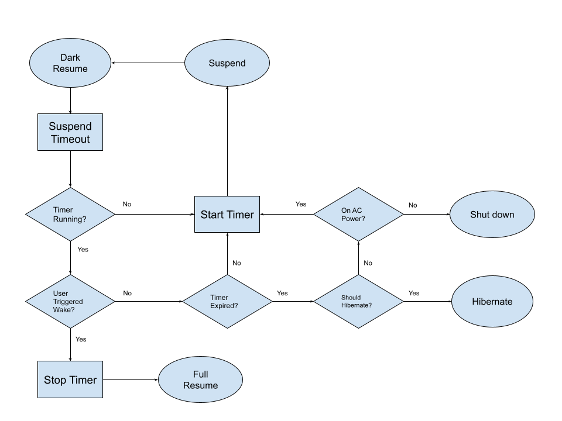

# Hibernate or Shutdown From Suspend

[TOC]

## Introduction

This feature extends the battery life of Chrome OS device during prolonged
non-use by proactively hibernating or shutting down the device after a
configurable time.

## Details

Chrome OS devices usually support at least 14 days of standby. Users that return
to the device tend to do so in the first 3 days. Thus instead of sitting in
standby until the battery is completely discharged, this feature suspends to disk
([hibernates]) or shuts down the device proactively after spending configured time
in standby. This helps in reducing battery degradation due to deep discharge.
This can also reduce the frequency of trickle charges during boot.

This flowchart depicts the state machine for shutdown-from-suspend.


powerd before every suspend will schedule an alarm (that can
wake the system from standby) if one is not already running for
`lower_power_from_suspend_sec` pref. On every resume, powerd
identifies if the wake is triggered by the user. If so, powerd stops the alarm
and resets the state machine. If not, powerd checks if the timer set above has
expired. If the timer has expired, powerd will hibernate the device if supported
and not disabled via `disable_hibernate`, or shut down the device if line power
is not connected.

## Enabling hibernate or shutdown from suspend on a new device

*   Make sure [Dark Resume] is enabled on the device.
*   Optionally configure `disable_hibernate` in your boxster config,
    if hibernate is supported on your device.
*   Configure `lower_power_from_suspend_sec` pref for the device.

## Debugging hibernate or shutdown from suspend

It's helpful to set a very low value for
`lower_power_from_suspend_sec`, like 30 seconds. Use
`powerd_dbus_suspend --disable_dark_resume=false` to suspend the machine
manually. Then examine `/var/log/power_manager/powerd.LATEST` to see what
happened on resume.

### Configuring hibernate or shutdown from suspend on a test image

*  [Enable Dark Resume] on the test image.
*  Optionally configure disable_hibernate using the step below. Note that
   hibernate must already be supported on your machine for this to actually
   hibernate, which requires more than just this change:
```sh
# echo 0 > /var/lib/power_manager/disable_hibernate
```
*   Perform the following steps to enable hibernate or shutdown from suspend:

```sh
# echo x > /var/lib/power_manager/lower_power_from_suspend_sec
# restart powerd
```

### Disabling hibernate or shutdown from suspend on a test image

Perform the following steps to disable hibernate globally, forcing powerd
to use shutdown from suspend only:
```sh
# echo 1 > /var/lib/power_manager/disable_hibernate
# restart powerd
```

Perform the following steps to disable hibernate or shutdown from suspend:

```sh
# echo 0 > /var/lib/power_manager/lower_power_from_suspend_sec
# restart powerd
```

[Dark Resume]: ./dark_resume.md
[hibernates]: ./hibernation.md
[Enable Dark Resume]: ./dark_resume.md#enabling-dark-resume
