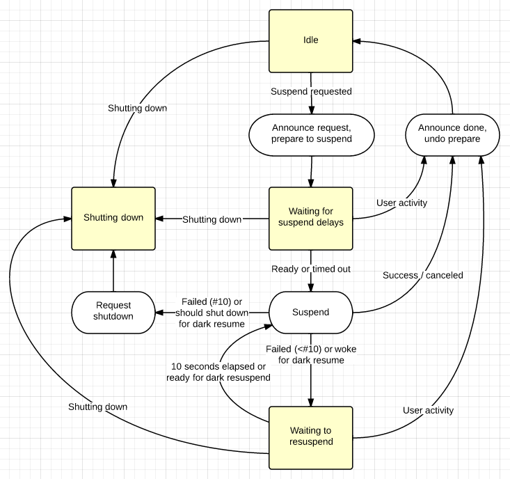

# Chrome OS Suspend and Resume

## Overview

This flowchart depicts the process that powerd's `Suspender` class follows to
suspend and resume a Chrome OS system:



Yellow boxes indicates states where powerd's event loop is running, white ovals
indicate discrete tasks that are performed, and arrows indicate events or other
occurrences that result in changes to the state.

The process begins when powerd (or some other process) decides that the system
should be suspended. Suspender receives a request to suspend the system and
generates an ID corresponding to the request. It performs pre-suspend
preparation, such as muting audio and turning off the panel backlight. Then, it
emits a `SuspendImminent` D-Bus signal to announce the suspend request to other
processes (particularly ones that have registered [suspend delays]). The
`SuspendDelayController` class is used to track the state of suspend delays.

After all suspend delays have become ready or have timed out, powerd starts a
suspend attempt. This involves using `powerd_setuid_helper` to run the
`powerd_suspend` script as root; this script is responsible for writing `mem`,
`freeze`, or `disk` to `/sys/power/state` (the actual act that tells the
kernel to suspend). If `powerd_suspend` reports that the system suspended and
resumed successfully, then the pre-suspend preparations are undone, a
`SuspendDone` D-Bus signal is emitted to inform other process that the suspend
request is complete, and `Suspender` is ready for the next suspend request.

If the suspend attempt fails, `Suspender` waits for ten seconds before running
`powerd_suspend` again to retry. After ten failed retries, the system is shut
down.

## Display Suspend State

The display state for suspend is controlled by Chrome for suspend.

-  When the SuspendImminent signal is received by Chrome, it turns off the
   display(s).
-  powerd still controls the backlight level during suspend, even though
   powering off the display will disable the backlight separately.
-  Chrome will turn the display(s) back on when it receives the SuspendDone
   signal.

## Wakeup Counts

The kernel provides a `[/sys/power/wakeup_count]` file that can be used to avoid
races while suspending. Drivers within the kernel increment this count in
response to user activity like keyboard or touchpad events.

-   When powerd receives a suspend request, it reads and saves the current
    count.
-   When the `powerd_suspend` script is run to suspend the system, it writes the
    previously-read count back to the `wakeup_count` file. If the number that it
    writes doesn't match the kernel's current count, the kernel reports failure,
    which results in `powerd_suspend` reporting failure, which results in the
    suspend attempt failing.
-   When `powerd_suspend` writes to `/sys/power/state`, the kernel again reports
    failure if the wakeup count has changed since powerd_suspend wrote to it.

This has the effect of letting suspend attempts get aborted if user activity is
observed by the kernel after the point at which the userspace powerd process
starts suspending the system.

powerd's `RequestSuspend` D-Bus method takes an optional externally-supplied
wakeup count. If a count is passed, powerd uses it instead of reading the
`wakeup_count` file. autotests exercising the suspend path typically pass a
count after installing a RTC wake alarm to trigger a resume several seconds
after suspending. If powerd sees a count mismatch, it aborts the suspend request
immediately. If it instead retried it ten seconds later, the retry would
probably occur after the wake alarm had fired, resulting in the system sleeping
forever.

## Suspend Freezer

IPC mechanisms such as FUSE (Filesystem in Userspace) create issues for the
[freeze step](https://www.kernel.org/doc/html/latest/power/freezing-of-tasks.html)
in the kernel. This is because the framework holds onto kernel locks
while waiting on a userspace process. A task can't freeze while it's holding
onto one of these locks. To address this, we impose an ordering on freeze in
userspace utilizing [cgroup freezers](https://www.kernel.org/doc/Documentation/cgroup-v1/freezer-subsystem.txt).
Only the children of the root freezer can be ordered.

-   The order is specified in pref files, `suspend_freezer_deps_<cgroup name>`.
    These files contain one dependency per line for the cgroup. For instance, if
    the cgroups A, B, and C exist (located in /sys/fs/cgroup/freezer/ as
    directories A, B, and C), and A depends on B and C, there will be a pref
    file named `suspend_freezer_deps_A` that contains the contents:
```sh
B
C
```
    This will cause cgroup A to freeze before cgroups B and C.
-   Pref files for a program's dependencies should be installed in
    `/usr/share/power_manager/` by the ebuild for that program.
-   A freezer cgroup for a program that requires freeze ordering to prevent
    timeouts on suspend should be created at boot via an upstart script that
    runs with `start on starting system-services`. The ownership of the
    `freezer.state` file should be set to `power:power`.
-   A package is responsible for making sure that all relevant tasks are part of
    its freezer cgroup. This may be done by writing the PID of the root process
    for a program to `/sys/fs/cgroup/freezer/<cgroup>/cgroup.procs`.
-   When declaring dependencies for a cgroup, A, declare all direct
    dependencies, even ones declared in the dependency file of another
    dependency. This is because cgroups listed in your dependency list may not
    exist at suspend time, and the dependency is skipped in this case. For
    instance, if A depends on B and C, and B depends on C, the dependency file
    for A should include B and C, instead of just B. This way, if B doesn't
    exist at suspend time, the correct ordering between A and C will be
    maintained.

## Dark Resume

On some systems, powerd passes a duration to the kernel in order to periodically
wake the system from the S3 state. This results in an
awake-with-the-display-off-and-audio-muted mode referred to as "dark resume".
After the system wakes into dark resume, powerd checks the battery level. If it
is low enough to suggest that the battery will be drained entirely while in S3,
resulting in a system that can't be used until it's recharged, powerd shuts down
the system. Otherwise, it re-suspends immediately.

## Dark Resume to Hibernate

On some systems, instead of shutting down after a certain amount of time as
described above, the system may opt to suspend to disk instead (AKA
[hibernate]). Hibernate represents a compromise between staying in suspend and
shutting down. User state is perfectly preserved, much like a regular suspend,
and power usage is identical to shutdown. The cost of this power savings is
additional latency at resume, expected to be similar in latency to a fresh boot.

## Enable console during suspend

Enabling console messages during suspend can help in debugging kernel panics
during suspend. By default console is enabled during system suspends to S3. But
if S0iX is enabled, console is disabled by default as console activity on the
UART can prevent system from suspending. To enable console temporarily for
debugging S0iX, perform the following steps

```sh
# echo 1 > /var/lib/power_manager/enable_console_during_suspend
# restart powerd
```

## Configuring suspend mode

Please look at [power states] documentation for info on suspend modes. If
`suspend_to_idle` preference is set then suspend mode is defaulted to 's2idle'.
Otherwise suspend mode can be configured using `suspend_mode` preference.
Currently valid suspend modes are `s2idle`, `shallow` and `deep`. To configure
suspend mode temporarily for debugging, perform the following steps

```sh
# echo mode > /var/lib/power_manager/suspend_mode
# restart powerd
```

Note that if suspend_to_idle is enabled, `suspend_mode` preference will not
matter.

## Firmware Updates

powerd will avoid suspending (or shutting down) if it believes that the firmware
is being updated. After seeing the presence of a lockfile in
`/run/lock/power_override`, powerd will act as if the suspend attempt failed and
retry it later. Files in this directory are created by various programs
including `flashrom` and `battery_tool`. There are additional details on the
[flashrom] page.

## External display timeout deferral

On certain platforms, external displays may undergo momentary disconnects. For
example, when a display is connected to a Thunderbolt 3 dock, an alternate mode
switch occurs during session state changes like while logging in, which causes
a switch from DisplayPort alternate mode to tunneled DisplayPort.

When in docked mode i.e with the lid closed, the system make take the momentary
disconnection to be an opportunity to enter system suspend. That may have
unwanted outcomes; in the case outlined above, it will result in the system
landing up on a lock screen immediately after entering in the login credentials.

To avoid this, we use a preference termed `defer-external-display-timeout` which
extends the amount of time `powerd` waits after a display disconnect before
triggering a system suspend, thus allowing momentarily disconnected external
displays to get re-connected.

The value is specified in seconds, and its default is 0 (which disables it).

[suspend delays]: https://chromium.googlesource.com/chromiumos/platform2/system_api/+/HEAD/dbus/power_manager/suspend.proto
[/sys/power/wakeup_count]: https://lwn.net/Articles/393314/
[flashrom]: https://dev.chromium.org/chromium-os/packages/cros-flashrom
[power states]: https://www.kernel.org/doc/Documentation/power/states.txt
[hibernate]: ./hibernation.md
