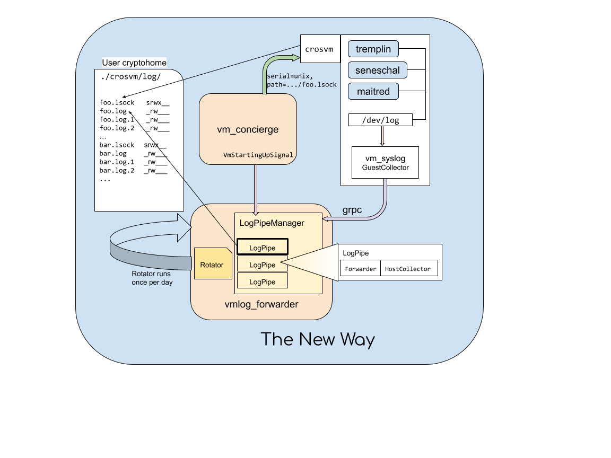

# Collecting VM logs

The [syslog](../syslog) directory implements a communication protocol for
gathering and persisting kernel and system logs for VMs.  This diagram shows the
flow of logs from the VM to the host system.

## vmlog_forwarder

When maitred starts a VM, it also launches the VM log forwarding service
(`vmlog_forwarder`).  This service listens on a well known port number on the
host system for kernel and userspace logs from VMs. Additionally it listens to
VmStartingUpSignal D-Bus signal from vm_concierge, and starts listening on
a Unix domain socket for logs from crosvm. From each source, log entries are
represented with the `LogRecord` protobuf message, which is defined in
[vm_host.proto](../proto/vm_host.proto).

`vmlog_forwarder` converts `LogRecord` messages into an
[RFC3164](https://tools.ietf.org/html/rfc3164) syslog message and forwards it
either to a VM-specific file in the user cryptohome, or to
the host system's syslog daemon (`rsyslogd` on Chrome OS).  Additionally,
`vmlog_forwarder` scrubs the contents of each `LogRecord` to ensure that the
message contents contain only valid UTF-8 code points.  Control and
non-character code points are converted into a minimum 3-digit octal
representation while invalid codepoints are replaced with the UTF-8 replacement
character (U+fffd).

## vm_syslog

`vm_syslog` is a program that runs inside every VM and acts as the syslog daemon
for that VM, accepting [RFC3164](https://tools.ietf.org/html/rfc3164) compliant
messages from system processes running inside the VM.

`vm_syslog` converts all log entries (both kernel and userspace) into
`LogRecord` messages before sending them out to the `vmlog_forwarder` service
running on the host system.  Readers may notice that `vm_syslog` accepts RFC3164
messages and `vmlog_forwarder` produces RFC3164 messages so it might seem
unnecessary to convert those entries into `LogRecord` messages.  However, every
VM is entirely untrusted and we'd prefer to rely on the well-tested protubuf
parsing code instead of trying to roll our own parser for untrusted messages.
