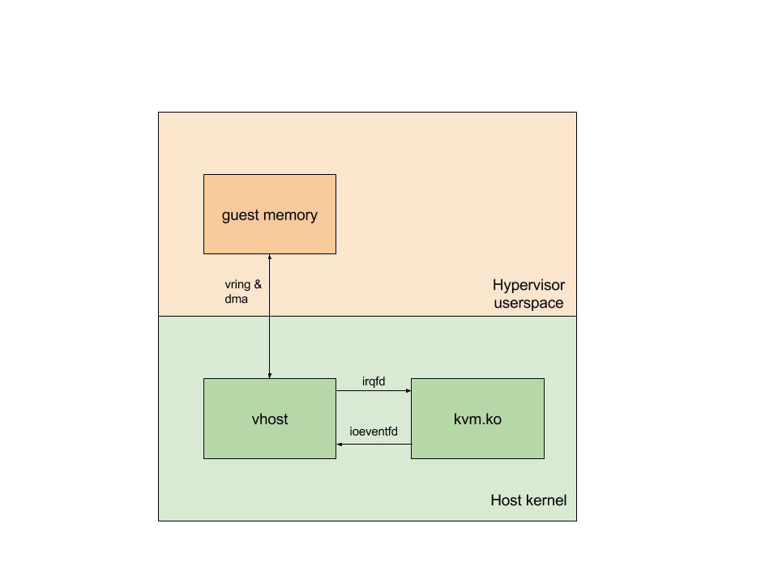
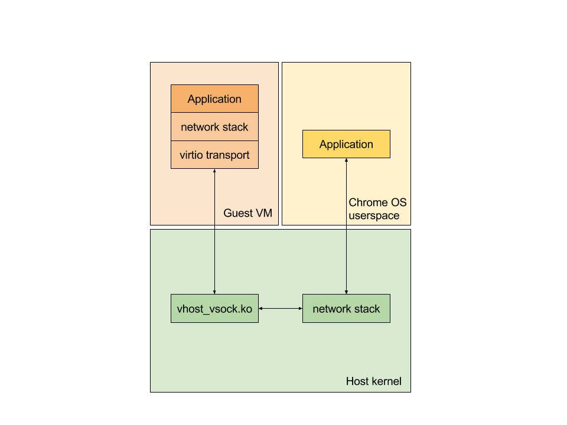

# virtio-vsock

virtio-vsock provides a way for applications running on a guest VM and the host
system to communicate with each other using the standard socket interface
(`socket`, `connect`, `bind`, `listen`, `accept`).  It defines a new socket
address family (`AF_VSOCK`) and uses a (context id, port) pair of integers for
identifying processes.  The host system always has 2 as its context id while
each guest VM is assigned a unique context id on startup.

## vhost

virtio-vsock is a vhost-based virtio device.  This means that the host kernel
manages all the data transfer while the hypervisor is only responsible for
dealing with control information.  This diagram gives a high-level overview:

An `irqfd` is a mechanism for injecting a specific interrupt into the guest VM
using an [eventfd](http://man7.org/linux/man-pages/man2/eventfd.2.html).  The
hypervisor creates an eventfd and uses a KVM ioctl to associate it with a
particular interrupt for the guest VM.  Writes to this eventfd then trigger that
interrupt in the guest.

An `ioeventfd` does the same thing but reversed.  The hypervisor creates an
eventfd and associates it with a particular region of the guest VM's memory.
Writes to this memory region by the guest VM will make the eventfd readable
without blocking.

`irqfd` and `ioeventfd` are used to implement I/O for virtualized devices that
does not block the guest VM cpu from running.

For vhost devices, the hypervisor performs some additional steps. It notifies
the vhost kernel module about the `ioeventfd` and the `irqfd` for the device as
well as the guest memory regions assigned for the virtual queues for that
device.  The vhost kernel module then takes care of listening on the
`ioeventfd`, processing the requests from the guest VM, and triggering an
interrupt in the guest on completion of the request through the `irqfd`.

## vsock

vsock provides a new backend for the guest VM's networking stack that talks to
the vhost_vsock host kernel module.  The host kernel module in turn uses the
host kernel's networking stack to transfer data from the application in the
guest VM to an application on the host system.

